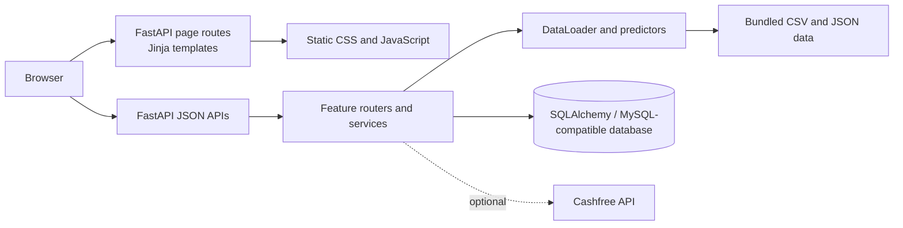
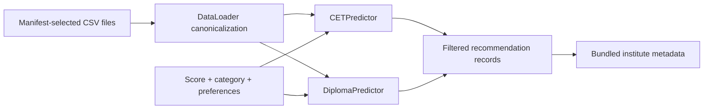

# DigiPath

DigiPath is a self-hostable FastAPI application for Maharashtra engineering admission exploration and student career-readiness workflows. It combines deterministic MHT-CET and Diploma/DSE recommendation tools with institute exploration, resume analysis, job matching, scam-risk screening, profiles, and a constrained in-app assistant.

> Admission results are decision-support outputs from the repository's bundled data, not eligibility determinations or seat guarantees. Scam results are heuristic risk screens, not proof that an organization is legitimate or fraudulent.

## The problem and the engineering response

Admission information is often fragmented across difficult-to-query cutoff files, institute information, pathway-specific rules, and category or seat-code conventions. Students may also need help preparing resumes, exploring roles, and assessing suspicious offers. Those problems are related, but their data and workflows are not uniform.

DigiPath is shaped by the implementation challenges visible in the repository:

- historical admission inputs are heterogeneous CSV and JSON files rather than one stable schema;
- First Year Engineering and Diploma/DSE data use different score metrics and source layouts;
- CAP categories, seat codes, quota, gender/special seats, and university scope must not be treated as interchangeable labels;
- institute records need normalization before they can enrich predictor results;
- document analysis and user-context features need bounded uploads, authentication, and persistence; and
- production needs explicit configuration, MySQL-compatible persistence, and TLS-aware managed-database connectivity.

The application therefore remains a server-rendered monolith: one FastAPI process serves pages, APIs, static assets, datasets, and feature services. Its route, service, predictor, and data-loader boundaries keep that deployment model manageable.

## Modules

| Module | Current implementation | Status |
| --- | --- | --- |
| Institute explorer | Searches bundled institute JSON data through page and API routes. | Available |
| MHT-CET predictor | Filters normalized First Year Engineering cutoff records by score, category/seat context, and preferences. | Available; estimates only |
| Diploma/DSE predictor | Uses Diploma/Direct Second Year data and percentage-oriented inputs. | Available; estimates only |
| Admission data loader | Normalizes a configured CSV manifest, maps column aliases, and rejects selected non-canonical datasets. | Available |
| Resume Analyzer | Accepts bounded PDF/DOCX uploads and returns structured feedback; history routes are present. | Available |
| Resume Builder | Server-rendered resume-building page. | Available |
| Job Recommender | Matches requests against bundled job data. | Available; local-data limits apply |
| Scam detector | Analyzes text, supported documents, URLs, and blacklist signals. | Heuristic screening only |
| Assistant | Routes bounded requests to local predictor, scam, resume, retrieval, or guidance flows. | Available; no external LLM required |
| Authentication and profiles | Argon2 hashes, JWT session cookies, editable profile settings, credits, bookmarks, and admin controls. | Available |
| Cashfree payments | Order, verification, and webhook endpoints. | Disabled until real credentials are configured |

## Architecture



See [Architecture](docs/ARCHITECTURE.md) for route ownership, data flow, authentication, persistence, and deployment boundaries.

### Admission-data and predictor workflow

`data_loader.py` owns the admission-data manifest. It reads the configured First Year Engineering and Diploma/DSE CSV sources, maps source-specific column aliases into a canonical schema, normalizes records, and exposes separate datasets to `CETPredictor` and `DiplomaPredictor`.

The predictors use pathway-specific scores: CET uses a percentile and Diploma/DSE uses a percentage. They interpret category and seat-code context alongside branch, city, college type, year, round, and university-scope filters. Results are historical-data-derived records and must be checked against current official CAP information.



## Technology stack

- Python 3.10+ and FastAPI
- Jinja2 templates, vanilla JavaScript, and CSS
- SQLAlchemy 2.x with PyMySQL for MySQL-compatible persistence
- Pandas, NumPy, and scikit-learn dependencies for data-oriented components
- Argon2 via `passlib`, JWTs via `python-jose`, and HTTP-only cookies
- `pdfplumber`, `python-docx`, and ReportLab for document features
- Optional Cashfree payment integration

## Local setup

Prerequisites: Python 3.10+, Git, and a reachable MySQL-compatible database.

```powershell
git clone <repository-url>
cd DigiPath
python -m venv .venv
.\.venv\Scripts\Activate.ps1
pip install -r requirements.txt
Copy-Item .env.example .env
```

Set a local `DATABASE_URL` and a newly generated `SECRET_KEY` in `.env`, then start the application:

```powershell
uvicorn app:app --reload
```

Open `http://127.0.0.1:8000`; FastAPI's API documentation is available at `/docs`. For a fuller walk-through, see [the developer tutorial](docs/TUTORIAL.md).

## Configuration

Copy `.env.example` to `.env` and keep `.env` out of version control.

| Variable | Purpose |
| --- | --- |
| `DATABASE_URL` | SQLAlchemy URL for the MySQL-compatible database; the driver is `mysql+pymysql`. |
| `SECRET_KEY` | JWT signing key. Generate a unique value; do not retain the example placeholder. |
| `ACCESS_TOKEN_EXPIRE_MINUTES` | Access-token lifetime; defaults to `1440`. |
| `ALLOWED_ORIGINS` | Comma-separated origins allowed by CORS. |
| `COOKIE_SECURE` | Set `true` when HTTPS terminates in front of the application. |
| `LOG_LEVEL` | Application logging level. |
| `BOOTSTRAP_ADMIN_EMAIL`, `BOOTSTRAP_ADMIN_PASSWORD` | One-time administrator provisioning inputs; remove the password after provisioning. |
| `CASHFREE_APP_ID`, `CASHFREE_SECRET_KEY`, `CASHFREE_ENV` | Required only to enable Cashfree endpoints. |

For Render with Aiven MySQL, the current connection code recognizes `ssl-mode=REQUIRED`, removes that PyMySQL-incompatible URI option, and builds a verified TLS context. If Render provides `/etc/secrets/ca.pem`, it is loaded as an additional trusted CA. See [deployment details](docs/DEPLOYMENT.md#aiven-mysql-on-render).

## Testing

```powershell
python -m unittest discover -s tests -v
```

The current suite covers predictor category/seat-code behavior and core scam-screening behavior. Before a release, manually exercise authentication, protected pages, profile updates, predictor validation, a sample resume upload, and the deployed database connection using non-production data and credentials.

## Deployment

`render.yaml` defines one Python Render web service that installs `requirements.txt` and starts:

```text
uvicorn app:app --host 0.0.0.0 --port $PORT
```

The health check is `GET /health`. Read [Deployment](docs/DEPLOYMENT.md) before configuring secrets, Aiven TLS, a custom domain, or Cashfree.

## Responsible use and limitations

- Refresh and independently verify admission data against relevant official CAP and institute sources for each counseling cycle.
- Do not treat predictor output as a promise of admission, eligibility, rank, or availability.
- Treat scam-screening output as a prompt for further verification, not an endorsement or accusation.
- Treat resumes, profile data, uploaded documents, reports, and payment data as sensitive.
- Keep Cashfree disabled until credentials and webhook behavior have been validated in the intended environment.
- The repository has no `LICENSE` file; do not assume reuse rights until maintainers publish one.

## Roadmap

- Document data provenance and repeatable dataset refresh procedures.
- Add predictor fixtures and broader route-level integration tests.
- Introduce reviewed database migrations instead of relying solely on startup schema creation.
- Review administrator workflows, accessibility, and mobile behavior.
- Consider an API-first split only after deliberate CORS, session, and end-to-end test design.

## Contributing and security

Start with [CONTRIBUTING.md](CONTRIBUTING.md) and [SECURITY.md](SECURITY.md). Keep changes focused, do not commit secrets or personal data, and identify the source and processing assumptions for any admission-data update.

## Repository map

```text
app.py                 Application assembly, lifecycle, page routes, and middleware
*_routes.py            API route groups and HTTP contracts
*_service.py           Feature/domain services
cet_predictor.py       CET and Diploma/DSE prediction classes
data_loader.py         Admission-data manifest, normalization, and filtering
data/                  Bundled admission, institute, job, and supporting datasets
models.py              SQLAlchemy persistence models
database.py            Engine/session lifecycle and startup schema work
templates/             Jinja server-rendered pages
static/                Browser CSS, JavaScript, and uploaded-avatar location
tests/                 Focused unittest regression suite
docs/                  Architecture, deployment, and onboarding documentation
```
