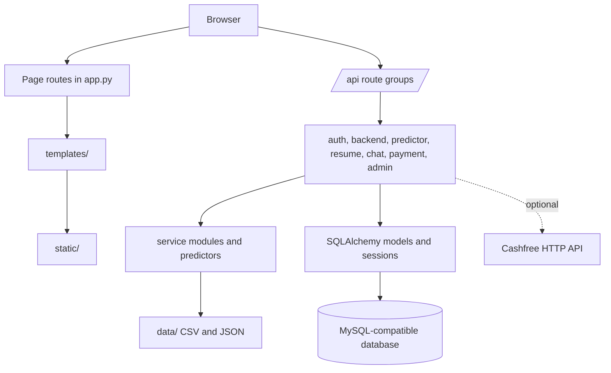
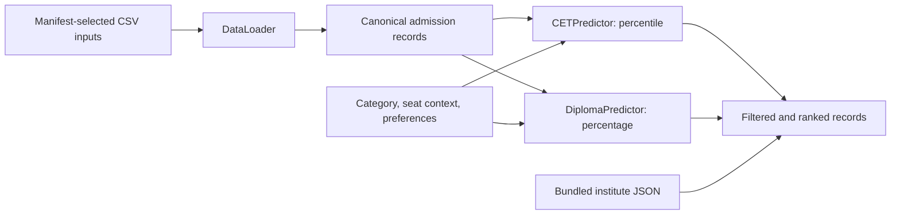
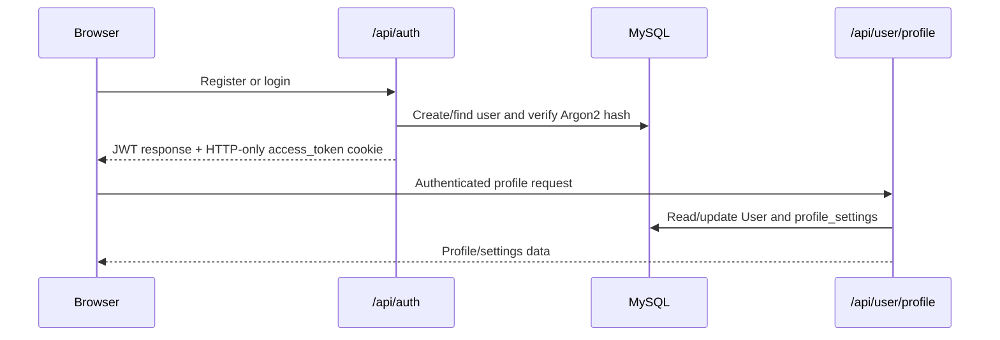

# Architecture

## System shape

DigiPath is a server-rendered FastAPI monolith. `app.py` creates one application, mounts `/static`, includes API routers, renders Jinja pages, configures CORS and optional SlowAPI middleware, and runs startup work through its lifespan handler. There is no separate frontend build, worker process, microservice, or external LLM dependency in the current implementation.

This shape lets a single deployment serve browser pages, APIs, bundled datasets, document-processing code, and static assets. The trade-off is that database availability and bundled data availability are both part of a successful application startup.

## Application assembly and lifecycle

`app.py` hydrates local environment values from `.env` when present, configures logging/CORS/static files/rate limiting, includes routers, and serves public and protected Jinja page routes. Its lifespan handler calls `create_database_tables()`, loads institute JSON into the in-memory registry, and invokes one-time administrator seeding when its environment settings are supplied.

`GET /health` is a lightweight process health endpoint returning `{"status":"ok"}`.

## Route ownership

| Location | Responsibility |
| --- | --- |
| `app.py` | Application setup, lifecycle, health endpoint, page routes, and institute registry. |
| `auth_routes.py` | Registration, login/logout, current-user access, and authentication dependencies. |
| `backend_routes.py` | Institute, scam, job, profile/settings/avatar/bookmark, and supporting APIs. |
| `predictor_routes.py` | CET and Diploma/DSE prediction APIs, filters, history, trends, and reports. |
| `resume_routes.py` | Resume upload/analysis, tailoring, and history endpoints. |
| `chat_routes.py` | Bounded conversation handling and intent routing to local capabilities. |
| `cashfree_routes.py` | Optional Cashfree order, verification, and webhook endpoints. |
| `admin_routes.py` | Protected administrator pages and management/reporting endpoints. |

The page routes in `app.py` render `dashboard.html`, `profile.html`, `predictor.html`, `job_recommender.html`, `resume_analyzer.html`, `resume_builder.html`, `roadmap.html`, and other feature pages. They use the same bearer-token/cookie session model as APIs.

## Frontend

`templates/` contains server-rendered HTML. `static/` contains browser JavaScript and CSS, including shared authenticated-shell assets. Pages call JSON endpoints with browser credentials where necessary; there is no separate SPA framework.

The frontend boundary is intentionally thin: templates compose pages, while validation and durable state remain in FastAPI routes and services. Dashboard navigation uses existing page routes; profile editing uses `/api/user/profile` rather than a second profile implementation.

## Admission data and predictors

`data_loader.py` is the predictor-data ingestion boundary. Its manifest identifies these intended inputs:

- `data/fe_2024.csv` and `data/fe_2025.csv` for CET/First Year Engineering;
- `data/converted_college_data_final.csv` and `data/CAP_Cutoff_Data.csv` for Diploma/DSE.

The loader maps alternate source column names to a canonical schema, standardizes college codes, cleans and normalizes location/category/seat-related fields, and maintains separate CET and DSE datasets. It explicitly rejects selected merged/cleaned CSV files as predictor sources, preventing accidental use of a different dataset shape.

`CETPredictor` and `DiplomaPredictor` are deterministic, data-driven components. They accept pathway-specific score inputs and filter for category, explicit seat code, ladies/special eligibility, university scope, branch, city, college type, year, and round where supplied. Predictor routes can persist authenticated prediction history, but a prediction is never an official allocation or eligibility decision.

## Persistence and database connections

`models.py` defines the SQLAlchemy schema for users and feature records. `database.py` constructs a PyMySQL-backed engine, eagerly probes it, provides `SessionLocal` and `get_db()`, and runs `Base.metadata.create_all()` during startup. It also contains limited current-user column adjustments.

The database is MySQL-compatible, not PostgreSQL. In production, `database.py` recognizes `ssl-mode=REQUIRED` only for `mysql+pymysql` URLs, removes that unsupported PyMySQL keyword, and passes a verified `SSLContext`. If `/etc/secrets/ca.pem` exists, it is loaded as an additional CA for that context. See [Deployment](DEPLOYMENT.md#aiven-mysql-on-render).

Startup schema creation is convenient for the current application but is not a substitute for reviewed, versioned migrations as the schema evolves.

## Authentication and profiles

Passwords are hashed through the configured Argon2 path. Login creates a signed JWT and writes it to an HTTP-only `access_token` cookie with `SameSite=Lax`; `COOKIE_SECURE` controls the secure flag. API and page guards accept a bearer token or that cookie, then resolve the user from the database. Profile settings, saved colleges/jobs, credits, and avatar metadata are stored with the user record; validated avatar files are written below `static/uploads/avatars/`.

## Major feature flows

### Resume analysis

`resume_routes.py` saves a bounded upload to a temporary location, accepts PDF/DOCX formats, and delegates extraction and analysis to `resume_service.py`. The route closes the upload and removes temporary data after use. Authenticated requests can save analysis history.

### Job recommendations

Job endpoints in `backend_routes.py` call `job_service.py` against bundled job data. The Job Recommender page is an integration over that existing API/service path, not a remote job platform.

### Scam screening

`scam_service.py` evaluates text, a supported document, or a URL using signals such as fee/payment demands, urgency, email/domain traits, and blacklist matches. `backend_routes.py` exposes the related APIs and reporting/administration flows. Output is explanatory risk guidance, not verification.

### Assistant

`chat_routes.py` keeps current browser conversation context bounded and routes recognized requests to local predictor, scam, resume, retrieval, or guidance paths. It does not execute arbitrary code, access secrets, or call an external LLM in the current implementation.

## External integration and configuration

Cashfree is the explicit external HTTP integration. Its routes construct provider requests only when non-placeholder `CASHFREE_APP_ID` and `CASHFREE_SECRET_KEY` values are configured; webhook handling verifies an HMAC signature.

Configuration comes from environment variables, with `.env` loaded for local development. Core settings are `DATABASE_URL`, `SECRET_KEY`, `ALLOWED_ORIGINS`, `COOKIE_SECURE`, and `LOG_LEVEL`. Optional administrator bootstrap and Cashfree variables are documented in [Deployment](DEPLOYMENT.md). Secrets must never be placed in templates, static assets, or committed `.env` files.

## Deployment and evolution constraints

The current production topology is one Render web service running Uvicorn with a managed MySQL-compatible database. Render can mount the Aiven CA as `/etc/secrets/ca.pem`; the same process serves Jinja pages and APIs, avoiding a cross-origin frontend split.

Run `python -m unittest discover -s tests -v` for the focused unittest suite. It covers predictor category/seat-code semantics and scam-service behavior. A root-level `test_register.py` is a live-server probe that expects an app on port 8000; it is not part of `tests/` discovery.

Preserve these constraints when changing the architecture:

- do not collapse CET percentile and DSE percentage semantics;
- do not loosen category/seat-code filtering into generic text matching;
- keep predictor outputs framed as historical-data-derived estimates;
- retain bearer-header and HTTP-only-cookie authentication paths;
- retain bounded uploads and avoid committing personal data;
- keep verified MySQL/PyMySQL TLS behavior unless deliberately migrating; and
- introduce versioned migrations and broader integration coverage before materially expanding persistence or deployment topology.
